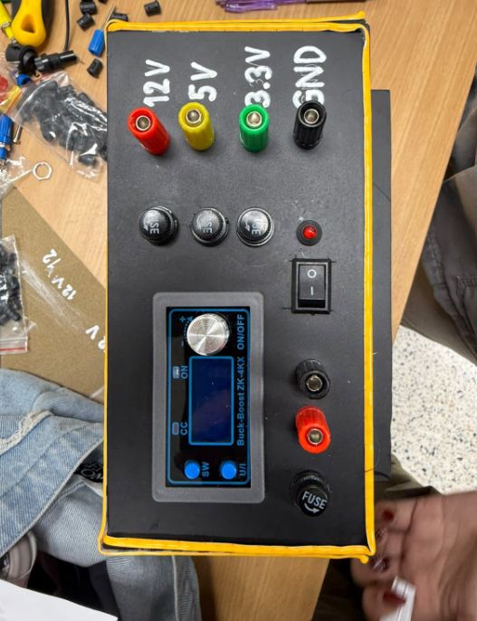
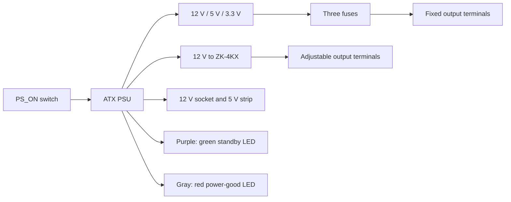
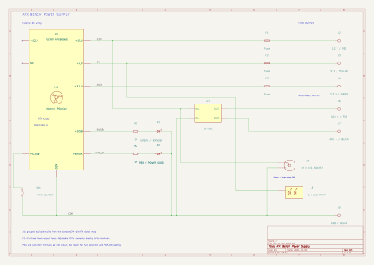
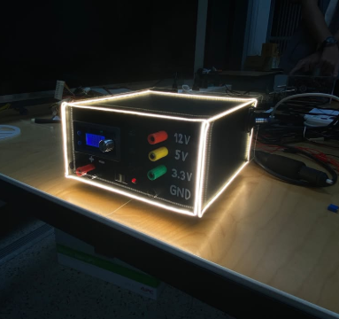

# DIY ATX Bench Power Supply

**Project 1 · Electronics Circuits Laboratory · 091013107**

| Name | Student ID |
|---|---|
| Sirawit Lila | 6809098660047 |
| Pichawee Rungwiboontikul | 6809107660067 |

## 1. Introduction

This was our first power supply project. As second-year students, we studied how an ATX power supply works and used it to build a supply for small circuit experiments. The project combines fixed outputs with an adjustable output in one box.

The fixed outputs are 12 V, 5 V and 3.3 V, with a common GND terminal. A ZK-4KX buck–boost module provides the adjustable output. We also added a 12 V cigarette-lighter power socket, a 5 V LED strip and two status LEDs, while retaining the original PSU fan. We worked together on the project.

### Source PSU

We used a **PLENTY COMPUTER ATX500WS**, marked **MAX 500 W**. The rear inlet states **AC 230 V Only**. Its nameplate ratings are:

| Output | Current on label |
|---|---:|
| +3.3 V | 22 A |
| +5 V | 14 A |
| +12V1 | 13 A |
| +12V2 | 14 A |
| −12 V | 0.8 A |
| +5VSB | 2.5 A |

The +3.3 V and +5 V rails share a 130 W limit. These are source ratings; each panel branch is also limited by its own fuse, wire and connector. The [source PSU record](docs/source-psu.md) includes the label photographs and the +12V1 label calculation.

## 2. Objectives

- Use the ATX outputs to power small circuits.
- Add voltage adjustment and a current-limit setting using the ZK-4KX.
- Connect the output terminals, switch, indicators and three fixed-output fuses.
- Apply basic voltage, current, resistance and power calculations to the circuit.

## 3. Circuit operation

### Fixed outputs and fuses

Each fixed positive terminal has its own fuse. F1 serves 12 V, F2 serves 5 V and F3 serves 3.3 V. The black GND terminal is the common return. These three fuses are connected only to the fixed-output branches. The other circuits take their supply directly from the PSU board outputs.

| Output | Front-panel terminal | Standard ATX wire |
|---|---|---|
| +12 V | Red | Yellow |
| +5 V | Yellow | Red |
| +3.3 V | Green | Orange |
| GND / COM | Black | Black |

The panel colors and ATX wire colors are different, so the voltage labels identify the outputs.

### Switch and indicators

The main switch connects the green PS_ON wire to COM to turn on the main outputs. Opening the switch turns them off. The purple +5VSB wire supplies the green standby LED. The gray PWR_OK wire supplies the red LED, which follows the PSU's power-good signal. Each LED has a 1 kΩ series resistor.

Standby power can remain active while the main switch is off. With this arrangement, the green LED can also stay on during main operation. The LED calculations and PWR_OK loading are discussed in Section 5.

### Adjustable output

The ZK-4KX uses the 12 V supply as its input. It can step the voltage up or down and lets us set a current limit. OUT+ connects directly to the positive terminal; the negative terminal connects to OUT−. There is no separate external fuse in this adjustable-output branch. Using OUT− keeps the load current in the module's current-measuring path. It does not electrically isolate the output from the PSU. See the [module instructions](https://aitendo3.sakura.ne.jp/aitendo_data/product_img/power/DC-DC/ZK-4KX/ZK-4KX.pdf) for operation.

### Socket, fan and lighting

J8 is a **12 V panel-mount cigarette-lighter power socket with a protective cap**. The circuit uses its centre contact for +12 V and its outer electrical contact for COM. It provides a connection for 12 V accessories. The original PSU fan provides airflow, and the 5 V LED strip provides lighting around the box.

### Schematic

The schematic shows the low-voltage wiring with the ATX supply on the left and the output terminals on the right. Wires connect the components directly; dots mark connected junctions. J1 groups equivalent ATX signals, with the standard pin numbers retained in the KiCad symbol. These identify connector signals, not physical board pads. The original fan is shown inside the PSU, and the LED returns connect to COM.

[KiCad schematic](hardware/diy_atx_psu.kicad_sch) · [Full-size drawing](docs/images/schematic/diy_atx_psu.svg) · [Wire and pin table](docs/wiring-and-protection.md)

## 4. Bill of materials

| Part | Quantity | Function |
|---|---:|---|
| PLENTY ATX500WS power supply | 1 | Fixed rails and standby supply; MAX 500 W label |
| ZK-4KX module | 1 | Adjustable voltage and current limit |
| Fixed output terminals | 4 | 12 V, 5 V, 3.3 V and GND |
| Adjustable output terminals | 2 | OUT+ and OUT− |
| Fixed-output fuses and panel holders | 3 | One per fixed positive output |
| Main switch | 1 | PS_ON control |
| Green LED and red LED | 1 each | Standby and power-good indication |
| 1 kΩ resistors | 2 | LED current control |
| 12 V cigarette-lighter power socket | 1 | Automotive accessory connection |
| Original PSU fan | Included in PSU | Airflow |
| 5 V LED strip | 1 assembly | Lighting |
| Enclosure, wires and mounting parts | 1 set | Assembly and connections |

[Component references](docs/bom.md)

## 5. Calculations

These calculations use the assumptions shown below. The calculated values are not measured test results.

### LED current and resistor power

For a series resistor, `I = (Vs − Vf) / R` and `P = I²R`.

| LED | Calculation assumptions | Calculated current | Resistor power |
|---|---|---:|---:|
| Green | Vs = 5 V, Vf = 2.1 V, R = 1 kΩ | 2.9 mA | 8.41 mW |
| Red | Ideal PWR_OK = 5 V, Vf = 2.0 V, R = 1 kΩ | 3.0 mA | 9.00 mW |

For example, the green LED current is `(5 − 2.1) / 1000 = 0.0029 A`. Both calculated resistor powers are well below 0.25 W.

The gray PWR_OK wire is a status signal. Intel specifies its high voltage with a 0.2 mA load. Our red-LED example gives 3 mA, which is above that specified test load. The actual LED current depends on how much the signal voltage drops under load. Seeing the LED light up does not tell us whether PWR_OK stays within its voltage specification. [Intel PWR_OK specification](https://edc.intel.com/content/www/ca/fr/design/ipla/software-development-platforms/client/platforms/alder-lake-desktop/atx-version-3-0-multi-rail-desktop-platform-power-supply-design-guide/pwr-ok-required/)

### Converter input current

Using an example output of 15 W and an assumed efficiency of 85%:

`Iin = Pout / (efficiency × Vin)`

At 12 V input, `Iin = 15 / (0.85 × 12) = 1.471 A`.

At 11.2 V input, `Iin = 15 / (0.85 × 11.2) = 1.576 A`.

The input power is `15 / 0.85 = 17.647 W`, giving an estimated loss of `2.647 W`. This shows why input current and cooling matter when using a buck–boost converter.

### Wire resistance and voltage drop

For an example with 0.75 mm² copper wire, 0.5 m outward and 0.5 m returning, use copper resistivity `0.0175 Ω·mm²/m` at 20 °C:

`Rloop = 0.0175 × 1.0 / 0.75 = 0.0233 Ω`

At an assumed 3 A, `Vdrop = IR = 0.070 V` and `Ploss = I²R = 0.210 W`.

Contacts and fuses add resistance. The common return carries the combined return current from the connected fixed-output loads.

### Fuse selection example

For an assumed 1 A continuous load per fixed output and a preliminary 75% loading factor:

`Minimum nominal rating = 1 / 0.75 = 1.33 A`

A 2 A fuse is one possible choice for this example. The final choice also depends on the wire, holder, temperature, startup current and the fuse's ability to interrupt a DC fault. This example does not identify the fuses installed in our box, so the schematic labels them F1–F3 without giving an ampere rating. [Fuse selection reference](https://www.littelfuse.com/assetdocs/fuseology-selection-guide?assetguid=fa4aa360-f6c4-4eec-88a6-3d7ec3fe57d5)

[Detailed calculations](docs/calculations.md)

## 6. Construction

The front panel holds the fixed terminals, adjustable terminals, fuse holders, main switch and ZK-4KX controls. The socket and LED strip complete the assembly; cooling uses the original PSU fan. Internal photographs show the construction stage; the project enclosure is now closed.

[Construction photographs](docs/evidence-register.md) · [Front-panel arrangement](docs/mechanical.md)

## 7. Testing

The following table summarizes the team's reported functional test results. Results are recorded on a pass/fail basis.

| Check | Result |
|---|---|
| Unpowered wiring, polarity and continuity | PASS |
| PS_ON switching and standby/main indication | PASS |
| Startup, repeated-start and no-load operation | PASS |
| Fixed-output operation under load | PASS |
| Adjustable-output operation and current-limit check | PASS |
| Voltage-drop check | PASS |
| Ripple check | PASS |
| Thermal observation | PASS |
| Socket, fan and LED strip operation | PASS |
| Shutdown | PASS |

[Test summary and scope](docs/testing.md)

## 8. Discussion

PS_ON, +5VSB and PWR_OK have different jobs. PS_ON turns on the main outputs, +5VSB supplies standby power, and PWR_OK indicates that the main outputs are ready. The terminal colors on our panel differ from the ATX wire colors, so we use the voltage labels when connecting a load.

The 1 kΩ resistors limit LED current. F1–F3 protect the three fixed-output branches. The adjustable output has no separate external branch fuse. The socket and LED strip have no separate external branch fuses. These branches and the direct PWR_OK LED connection need to be considered when assessing the circuit's protection. The adjustable output is also limited by input power, conversion losses and cooling.

## 9. Operation

1. Start with the main switch off and the adjustable output disabled.
2. Connect AC and observe the green standby indicator.
3. Turn on the main switch and check the selected output voltage.
4. For the adjustable output, set voltage and current limit before connecting a load.
5. Use the labelled terminals and keep the fan and vents clear.
6. After use, disable the outputs, turn off the main switch and disconnect AC.

Disconnect AC and allow stored energy to discharge before changing wiring or fuses. Replace a fuse with a matching type and rating after finding the cause of the fault. The socket is used for accessories; a lighter heating element is outside the project application. [Operating procedure](docs/operation.md)

## 10. Conclusion

We built a bench power supply with 12 V, 5 V and 3.3 V terminals, an adjustable output and a 12 V accessory socket. The functional checks are summarized in Section 7. This first project gave us practice in wiring, mounting parts and calculating current and power. We worked together on the assembly and learned how the ATX control wires and adjustable module work.

## References

- Course handout: *Project 1 – ATX Bench Power Supply*, Chapter 3, Electronics Circuits Laboratory 091013107.
- Intel: [PWR_OK specification](https://edc.intel.com/content/www/ca/fr/design/ipla/software-development-platforms/client/platforms/alder-lake-desktop/atx-version-3-0-multi-rail-desktop-platform-power-supply-design-guide/pwr-ok-required/) and [ATX voltage regulation](https://edc.intel.com/content/www/us/en/design/ipla/software-development-platforms/client/platforms/alder-lake-desktop/atx-version-3-0-multi-rail-desktop-platform-power-supply-design-guide/2.1a/dc-voltage-regulation-required/).
- Parts Express: [ZK-4KX module instructions](https://aitendo3.sakura.ne.jp/aitendo_data/product_img/power/DC-DC/ZK-4KX/ZK-4KX.pdf).
- Littelfuse: [Fuseology selection guide](https://www.littelfuse.com/assetdocs/fuseology-selection-guide?assetguid=fa4aa360-f6c4-4eec-88a6-3d7ec3fe57d5).

[Team contribution](docs/contributions.md) · [Project files](docs/repository-guide.md)
