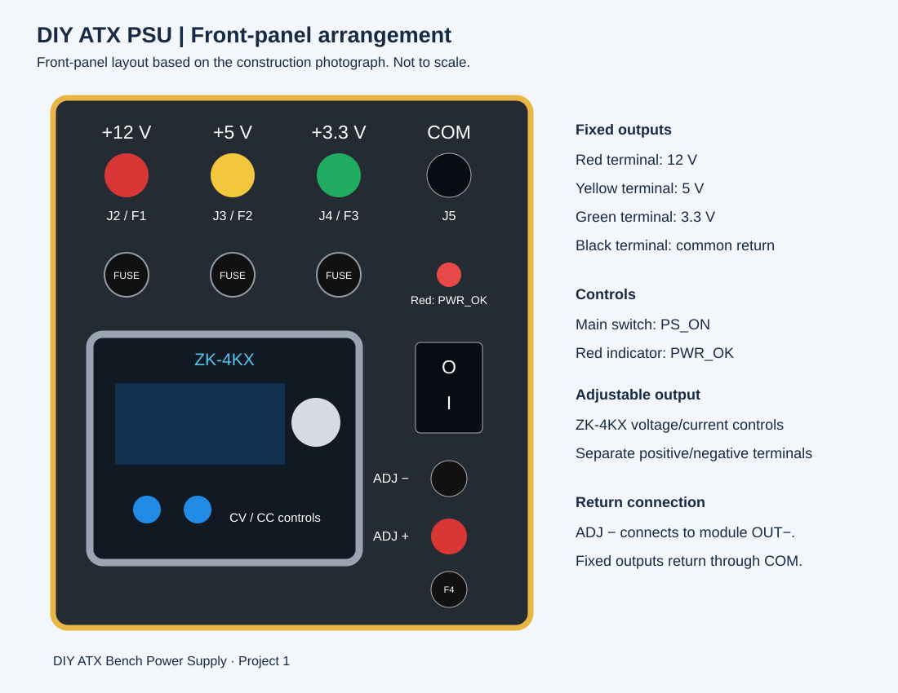

# Mechanical Arrangement

The front panel groups the fixed terminals above the adjustable-output controls. Three fuse holders serve the fixed outputs. The main switch and status indicator provide the panel controls, while the fan and LED strip support airflow and lighting.

*Layout illustration based on the construction photographs; not to scale.*

The enclosure is closed for operation. Insulation around terminal backs, secure wire routing, strain relief and clearance from fan blades are important construction details. The adjustable return is routed to the module OUT−, and the shared COM path carries the combined fixed-output return current.

[Construction photographs](evidence-register.md)
