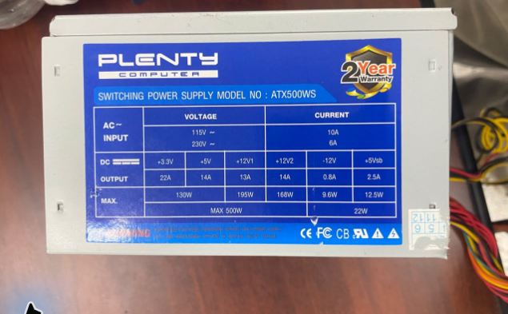
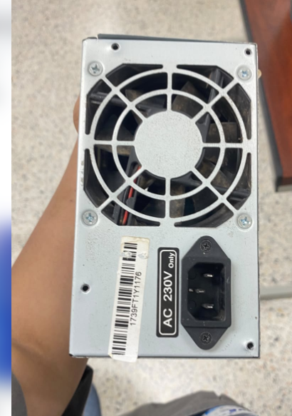

# Source Power Supply

The source is a **PLENTY COMPUTER ATX500WS** switching power supply. Its main label states **MAX 500 W**. The rear AC inlet is marked **AC 230 V Only**; this is the input marking used for this unit.

## DC output ratings

| Output | Current on label |
|---|---:|
| +3.3 V | 22 A |
| +5 V | 14 A |
| +12V1 | 13 A |
| +12V2 | 14 A |
| −12 V | 0.8 A |
| +5VSB | 2.5 A |

The label gives a combined 130 W for +3.3 V and +5 V, 168 W for +12V2, 9.6 W for −12 V, and 12.5 W for +5VSB. It also shows a combined 22 W for −12 V and +5VSB.

The +12V1 column contains an inconsistency: it lists 13 A and 195 W, while `12 × 13 = 156 W`. Current calculations therefore use 13 A rather than deriving a higher current from 195 W. The two +12 V groups are kept separate in the source rating table; the project does not join them to claim a combined terminal current.

These are PSU nameplate ratings. The current at a panel output also depends on its fuse, wire and connector. The MAX 500 W marking is not a 500 W rating for the adjustable output.

## AC input

The main label contains 115 V / 10 A and 230 V / 6 A entries, while the rear inlet explicitly specifies AC 230 V Only. The rear marking identifies the operating input for this unit.

## Cooling

The fan belongs to the PSU's original internal circuit. It is included as part of the source assembly, rather than as an added external 12 V load. The schematic shows it as a functional part of the PSU without assigning an internal supply wire.
